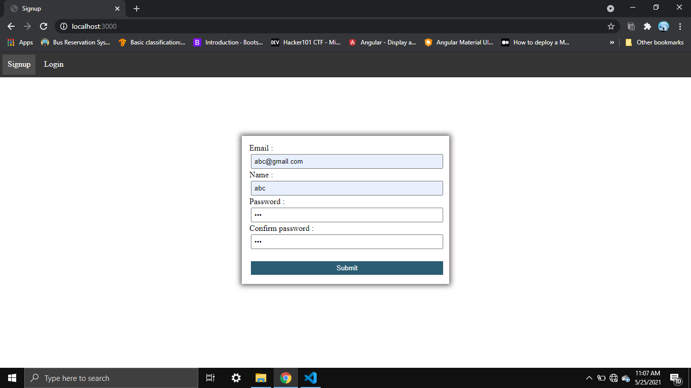
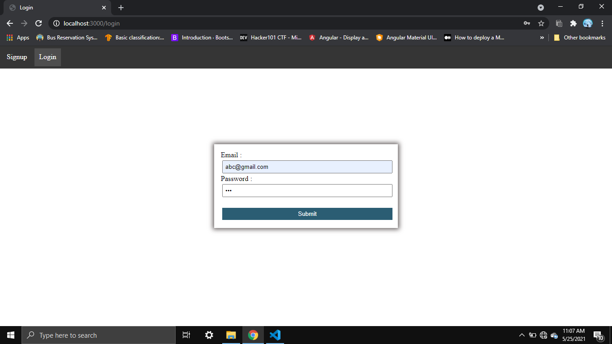
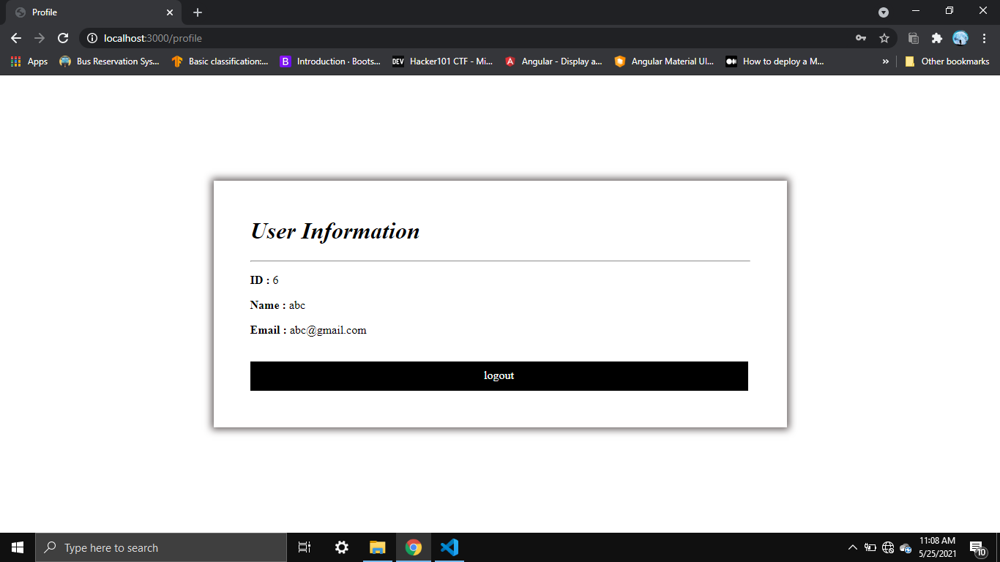

# Session (NodeJS-MongoDB-EJS)
Adding a session to the website, so that it can remember the user by using the "express-session".

That is once you login to the website it will remembers you and when you visit next time it will directly open profile page.

<h2>Dependencies</h2>
<ul>
    <li>NodeJS</li>
    <ul type="circle">
        <li>ExpressJS</li>
        <li>Mongoose</li>
        <li>express-session</li>
        <li>connect-mongo</li>
        <li>EJS (Embedded JavaScript)</li>
    </ul>
    <li>MongoDB</li>
</ul>

<h2>Steps</h2>

step 1: First create a directory for your new application and navigate into it.

<pre>
mkdir myapp
cd myapp
</pre>

step 2: Use the npm init command to create a package.json file for your application.

<pre>
npm init
</pre>

step 3: Now install Express and Mongoose in the myapp directory and save it in the dependencies list of your package.json file.

<pre>
npm install express mongoose express-session connect-mongo ejs --save
</pre>

step 4: Copy above code paste it in the myapp directory.

step 5: Run the application.

<pre>
node app.js
</pre>

<h2>Result</h2>

<h2>Reference</h2>
<ul>
    <li>https://www.npmjs.com/package/express-session</li>
    <li>https://mongoosejs.com/docs/schematypes.html</li>
</ul>
